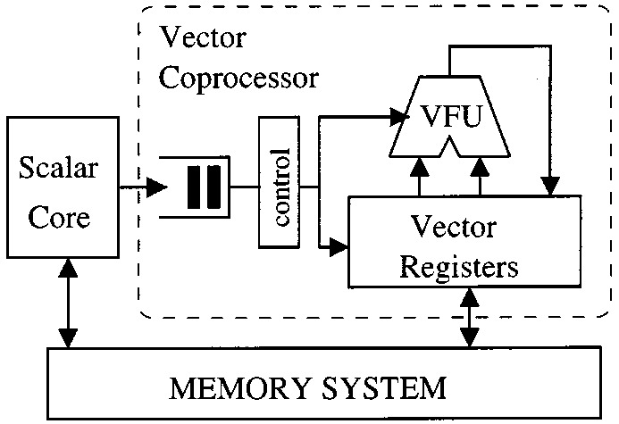
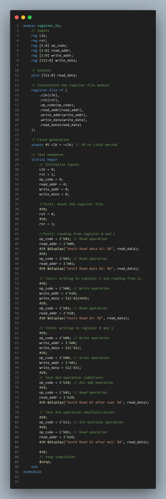
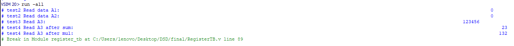
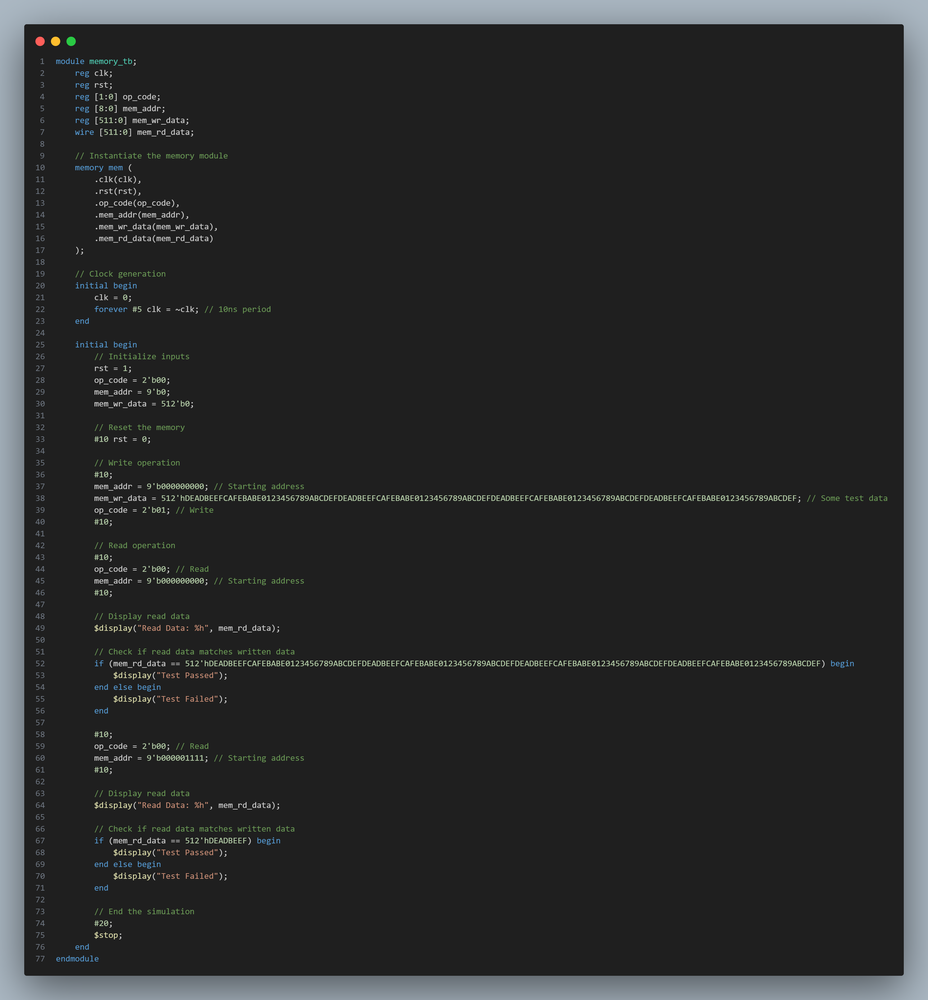
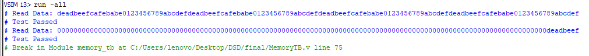

# VecProcessor-Verilog
Vector Processor with four 512 bit registers dessigned in verilog with ALU and shared Memory.
 
 

## Table of Contents
- [Features](#features)
- [Implementation](#implementation)
- [Results](#results)
- [Contributors](#contributors)

# Features
- 512-bit Register File: Contains four 512-bit registers (A1 to A4) with dual read/write ports for simultaneous access.
- Dual-Ported Register File: Supports reading from and writing to two individual registers simultaneously.
- ALU: Capable of performing 512-bit addition and multiplication operations. The results are split into lower (A3) and higher (A4) halves.
- Memory Module: 32-bit wide, 512-depth memory array. Supports load and store operations for 16 cells at a time.
- ALU Result Storage: Automatically stores the results of ALU operations in registers 2 (A3) and 3 (A4).

## Operation_Codes
2'b00: Load operation. the memory value of memory address is loaded on given register address.
2'b01: Store operation. the register data is stored on given memory address.
2'b10: Addition operation. The sum of A1 and A2 is stored in A3 and A4.
2'b11: Multiplication operation. The product of A1 and A2 is stored A3 and A4.

# Implementation
## ALU module
The ALU module takes two 512-bit input operands (A1 and A2) and performs the specified arithmetic operation based on the operation code (op). It also has two additional 512-bit inputs (A3 and A4) to retain the previous state or provide default values. The results of the operations are stored in write_on_A3 and write_on_A4.

## Register file Module
The register file module is designed to hold four 512-bit registers. It supports operations such as reading data from a specified register, writing data to a specified register, and performing ALU operations on the register contents.
- clk: Clock signal to synchronize operations.
- rst: Reset signal to initialize the registers.
- op_code: Operation code to specify the desired operation (read, write, ALU operation).
- read_addr: Address of the register to be read.
- write_addr: Address of the register to be written.
- write_data: Data to be written to the specified register.
- read_data: Data read from the specified register.

The Following Test bench makes sure that the register file and ALU modules are working properly for simple operations:
 

We get these results according to testbench:
 

## Memory Module
The memory module consists of a 32-bit wide memory array with a depth of 512. It supports two main operations: loading data from memory into a register and storing data from a register into memory. The operations are controlled by an opcode, and the memory address and data are specified through input signals.
- clk: Clock signal to synchronize operations.
- rst: Reset signal to initialize the memory.
- op_code: Operation code to specify the desired memory operation (load or store).
- mem_addr: Memory address for the operation.
- mem_wr_data: Data to be written to memory (for store operations).
- mem_rd_data: Data read from memory (for load operations).

Memory Operations
- Load Operation (op_code = 2'b00): Reads 16 consecutive 32-bit memory cells starting from the specified address and packs them into a 512-bit output register (mem_rd_data).
- Store Operation (op_code = 2'b01): Writes 16 consecutive 32-bit values from the input 512-bit register (mem_wr_data) into the memory cells starting from the specified address.

The Following Test bench makes sure that the memory is working properly:
 

We get these results according to testbench:
 

description: 
First we load a 512 bit number in memory which would take 16 blocks of 32 bit cells on the memory (The number is stored from address 0).
Then we read data from address 15. Due to the fact that the data was split into 16 parts and we are reading from 15th memory block then we would have the last MSB block of the number as our LSB on read data.

# VecProcessor
Finally we connect all these modules via the VecProcessor module. The processor is Expected to work via these opcodes that where introduced in [this](#Features) section. Inorder to check the processor we write following testbench. The test bench works with these steps:
1. First of we initialize the memory with 2 values so that we can test our module.
2. We give load instruction to load from 0 memory (which holds 1234 value) to register 0 (register A1).
3. Afterwards we do the exact same thing for 16 memory (which holds 4321 value) and register 1.
4. Then we give Sum instruction. It's expected to store 1234 + 4321 = 5555 on A3.
5. Then in order to make sure that the store instruction is working properly we give store instruction to save A3 value on memory (memory address 32).
6. Then we load the value of memory addres 32 to A1 register.
7. Then we give multiplication instruction.

# Contributors
- Armin Geramirad (St.no: 401110631)
