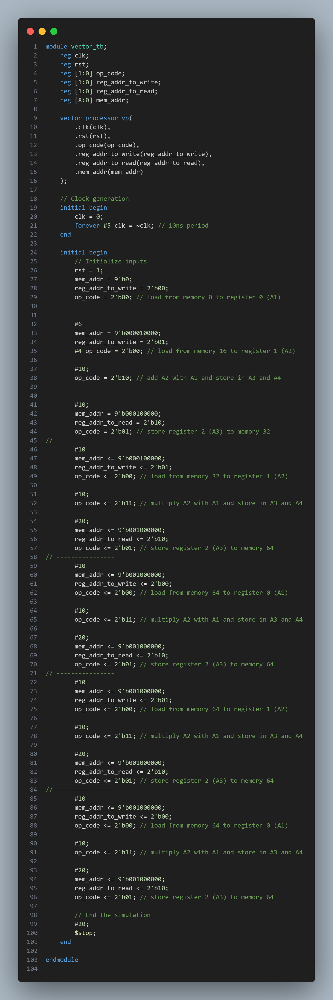
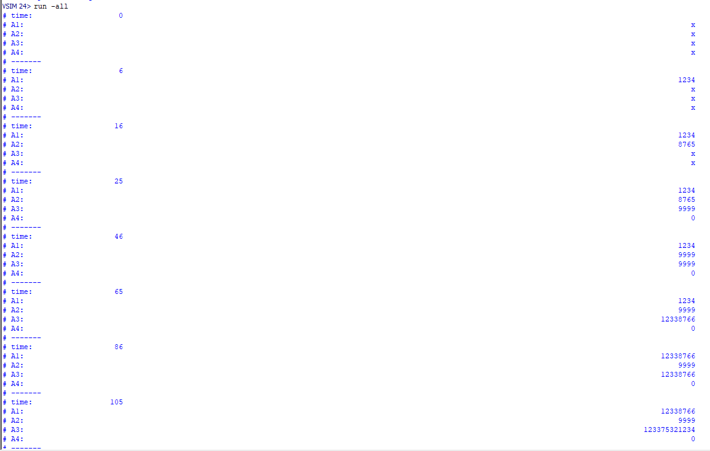

# VecProcessor-Verilog
Vector Processor with four 512 bit registers dessigned in verilog with ALU and shared Memory.
 
 

## Table of Contents
- [Features](#features)
- [Implementation](#implementation)
- [VecProcessor](#vecprocessor)
- [Contributors](#contributors)

# Features
- 512-bit Register File: Contains four 512-bit registers (A1 to A4) with dual read/write ports for simultaneous access.
- Dual-Ported Register File: Supports reading from and writing to two individual registers simultaneously.
- ALU: Capable of performing 512-bit addition and multiplication operations. The results are split into lower (A3) and higher (A4) halves.
- Memory Module: 32-bit wide, 512-depth memory array. Supports load and store operations for 16 cells at a time.
- ALU Result Storage: Automatically stores the results of ALU operations in registers 2 (A3) and 3 (A4).

## Operation_Codes
- 2'b00: Load operation. the memory value of memory address is loaded on given register address.
- 2'b01: Store operation. the register data is stored on given memory address.
- 2'b10: Addition operation. The sum of A1 and A2 is stored in A3 and A4.
- 2'b11: Multiplication operation. The product of A1 and A2 is stored A3 and A4.

# Implementation
## ALU module
The ALU module takes two 512-bit input operands (A1 and A2) and performs the specified arithmetic operation based on the operation code (op). It also has two additional 512-bit inputs (A3 and A4) to retain the previous state or provide default values. The results of the operations are stored in write_on_A3 and write_on_A4.

## Register file Module
The register file module is designed to hold four 512-bit registers. It supports operations such as reading data from a specified register, writing data to a specified register, and performing ALU operations on the register contents.
- clk: Clock signal to synchronize operations.
- rst: Reset signal to initialize the registers.
- op_code: Operation code to specify the desired operation (read, write, ALU operation).
- read_addr: Address of the register to be read.
- write_addr: Address of the register to be written.
- write_data: Data to be written to the specified register.
- read_data: Data read from the specified register.

The Following Test bench makes sure that the register file and ALU modules are working properly for simple operations:
 

We get these results according to testbench:
 

## Memory Module
The memory module consists of a 32-bit wide memory array with a depth of 512. It supports two main operations: loading data from memory into a register and storing data from a register into memory. The operations are controlled by an opcode, and the memory address and data are specified through input signals.
- clk: Clock signal to synchronize operations.
- rst: Reset signal to initialize the memory.
- op_code: Operation code to specify the desired memory operation (load or store).
- mem_addr: Memory address for the operation.
- mem_wr_data: Data to be written to memory (for store operations).
- mem_rd_data: Data read from memory (for load operations).

Memory Operations
- Load Operation (op_code = 2'b00): Reads 16 consecutive 32-bit memory cells starting from the specified address and packs them into a 512-bit output register (mem_rd_data).
- Store Operation (op_code = 2'b01): Writes 16 consecutive 32-bit values from the input 512-bit register (mem_wr_data) into the memory cells starting from the specified address.

The Following Test bench makes sure that the memory is working properly:
 

We get these results according to testbench:
 

description: 
First we load a 512 bit number in memory which would take 16 blocks of 32 bit cells on the memory (The number is stored from address 0).
Then we read data from address 15. Due to the fact that the data was split into 16 parts and we are reading from 15th memory block then we would have the last MSB block of the number as our LSB on read data.

# VecProcessor
The VecProcessor module connects all the individual components—register file, ALU, and memory—into a cohesive system capable of performing vector operations. The processor operates based on a set of opcodes to load, store, sum, and multiply 512-bit integer vectors. This section details the integration of these components and provides a testbench to verify the functionality of the processor.

To verify the functionality of the VecProcessor, we use a testbench that performs the following steps:
1. Initialize Memory: The memory is initialized with specific values to facilitate testing.
2. Load Instructions:
- Load the value from memory address 0 (which holds 1234) into register 0 (A1).
- Load the value from memory address 16 (which holds 8765) into register 1 (A2).
3. Sum Instruction: Perform the sum operation, expecting 1234 + 8765 = 9999 to be stored in A3.
4. Store Instruction: Store the value of A3 into memory address 32 to verify the store functionality.
5. Load from Stored Address: Load the value from memory address 32 back into register 0 (A1) to verify the correctness of the store operation.
6. Multiply Instruction: Perform the multiply operation with the new values in A1 and A2.
7. Store and Verify Multiplication: Store the multiplication result in another memory address, load it into another register, and multiply again.
8. Repeat for Verification: Repeat the above steps several times to ensure all corner cases are handled correctly.

The test bench is the following:
 

with respect to the test bench we get these results for our register:
 

The testbench described above operates on smaller numbers to ensure readability and facilitate verification of the results. This approach allows us to clearly observe the correctness of the operations.

* However, it should be noted that the testbench does not account for multiplication results that exceed 512 bits, meaning the A4 register remains 0 in these cases. To thoroughly evaluate the processor's performance with larger numbers and higher multiplication rates, I conducted additional tests using larger values. The results of these extended tests are documented in the [this](Assets/bigres.txt) text file. These tests confirm the processor's capability to handle more complex operations and provide accurate results even when dealing with larger datasets.

Additionally all the code are in Code folder and you are able to read and perform any other tests on desired modules.
I have also added a pdf report in [this](Vec-report.pdf) repo to getter a better view of how the code works and whats the logic behind it.

# Contributors
- Armin Geramirad (St.no: 401110631)
